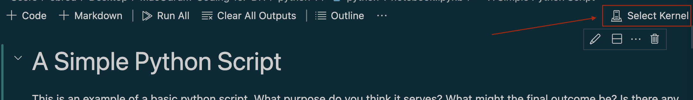
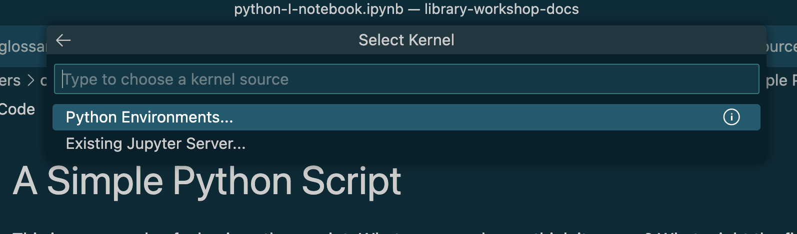
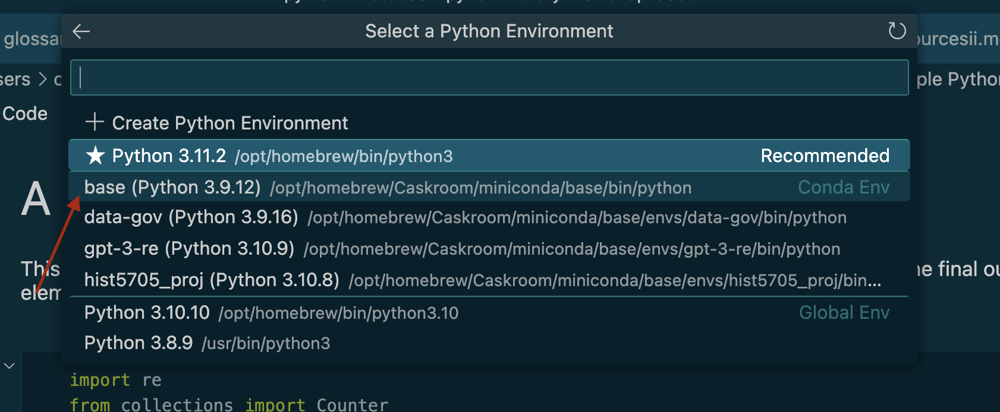
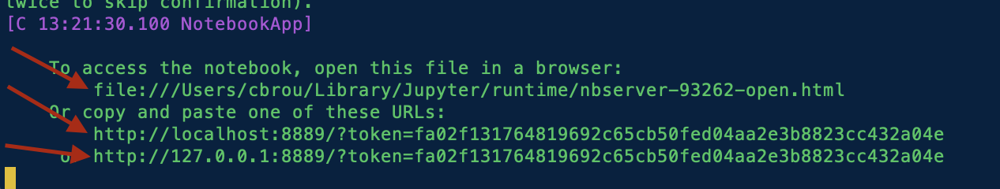
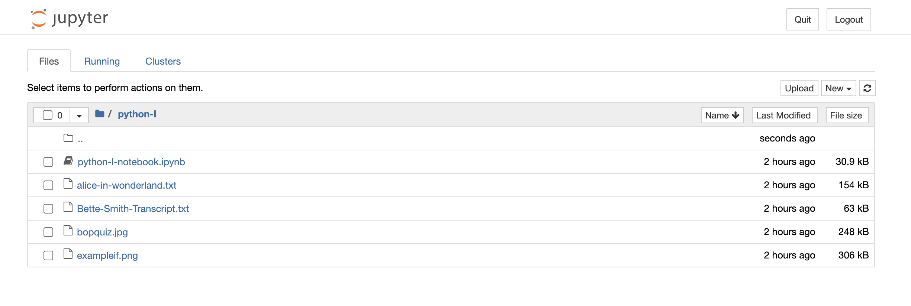
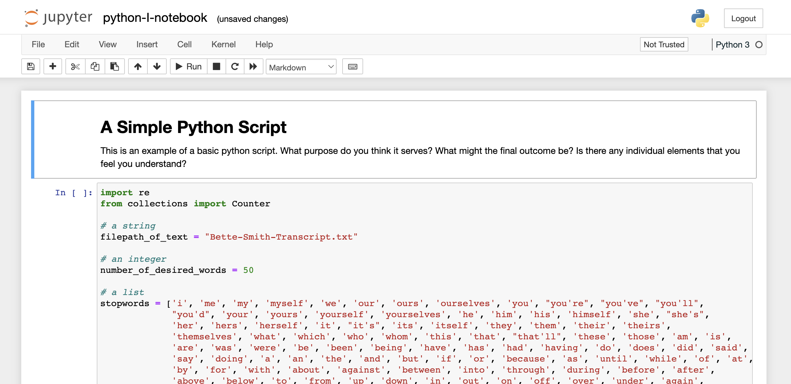

# Using Jupyter Notebook

Jupyter Notebook is an open-source application that allows users to create and share documents which can be composed of Python code, informative text, and visual guides. It facilitates the reproducibility of research when programming is invovled, but it also is an excellent teaching tool, since Jupyter Notebook allows you to easily run your code piece by piece, so you can truly understand what each line does.

You installed Jupyter Notebook as a pre-workshop task, so here's how to use it!

### Option #1: Using Visual Studio Code

If you have VS Code installed, when you click a `.ipynb` file aka a Jupyter Notebook file, the file will automatically open in VS Code. This is ideal, because VS Code provides an advanced Python **linter**, which is a tool that analyzes Python code for potential errors or style violations (typically shown via red colouring or underlining) and provides suggestions for improvement. However, we must first connect our notebook to a **kernel** which is the program that actually allows Jupyter Notebook to run and execute Python code. To do this:

1) When you have your notebook opened in VS Code, there will be a button that says "Select Kernel" in the upper right corner of the window. Click this.

2) After clicking "Select Kernel" a search bar with drop down options will appear. From the drop down options, select "Python Environments...".

3) Once "Python Environments..." is selected, more drop down items will appear. These are all the Python environments on your computer. Since you likely have not used Python prior to this workshop, there will just be your computer's "native" Python environment, and the miniconda environment titled "base". We want to use the miniconda environment rather than our computer's installation of Python, so select the option which starts with "base".

Now you're connected to a kernel so you can play with and run your notebook!

**If you cannot see the "Python Environments..." or miniconda "base" environment:** 

1) Fully close VS code, then open up your command line (Terminal for Mac OS, Anaconda Powershell Prompt for Windows).
    
2) Enter the commmand `conda deactivate base`. 
   
3) Close the command line completely (Mac OS users hit keys `Cmd` + `Q` at the same time to do this).
   
4) Reopen the command line then enter `conda activate base`.
   
5) Reopen VS Code and follow original 3 steps.

If VS Code is still not detecting your miniconda "base" environment, then proceed to Option #2.

### Option #2: Using the built in Jupyter Notebook UI

Jupyter Notebook also comes with a built-in user interface (UI) when installed! This can be accessed via the command line with the following steps:

1) Open the command line, then change directories into the folder where the Jupyter Notebook file you want to open and interact with is. In my case, I entered `cd Desktop/MacOdrum-Coding-for-DH/python-I`.
   
2) Now, enter the command `jupyter notebook`.

3) If this command does not automatically open a new tab or window in your default browser (Chrome, Firefox, Safari, etc.), paste any of the links provided to you in the command line into your browser's URL/address bar.

4) Now that the Jupyter Notebook UI is launched, you will see a file browser which shows the contents of the directory you navigated to in step #1. Click the `.ipynb` file you want to open.

You will now have an environment where you can interact with and run your notebook! 

5) When you finish working and have saved the notebook, to close Jupyter Notebook, return to your command line and hit the keys `Cmd` + `C` at the same time.