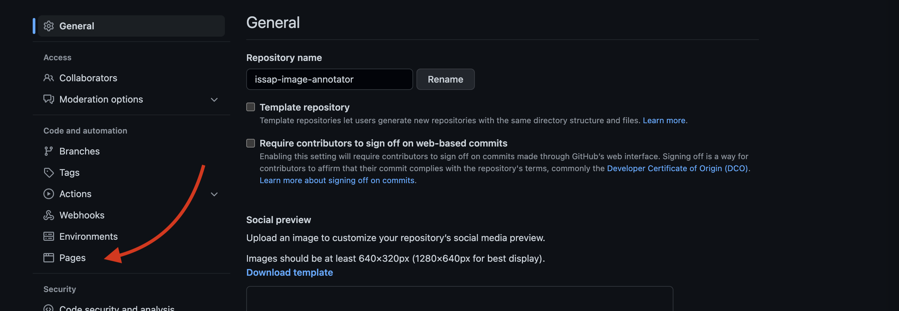
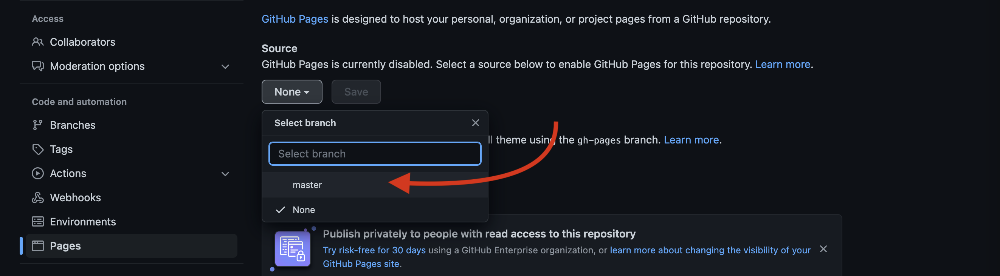
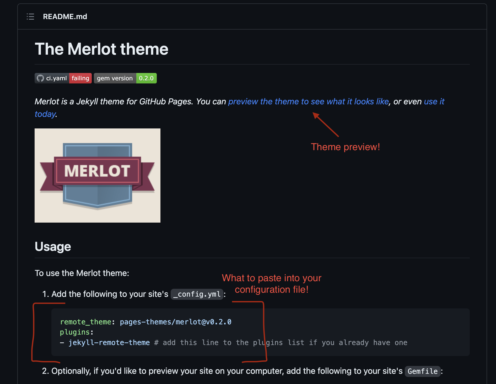

# Pushing to GitHub & Static Site Resources

## Using Git
### Creating a repository and adding it to Github
After going on to GitHub and creating a new repository by hitting the "+" symbol in the upper right corner:

1) `echo "# [your_project_name]" >> README.md`

   - This creates a README file (which you can modify later).

2) `git init`

   - This initializes your folder as a git repository (aka to be tracked with git).

3) `git add -A`

   - This command adds all of the files and/or changes you have made to the files in your folder to the git repository.

4) `git commit -m "first commit"`

   - This command confirms what you have added by requiring you to describe the additions you are making to your git repository.

5) `git branch -M main`

   - This sets the name of your repository's primary branch; "main" could be replaced by any word you please!

6) `git remote add origin [link to your repository on github]`

   - This tells git that you would like to connect the repository currently on your device to an externally hosted, "remote" service. In our case, this is GitHub.

7) `git push -u origin main`

   - This is the final "save", confirming all of the changes you made and fully adding them to both your local git repository and your remote repository on GitHub.

### Updating your repository following its creation

!!! info 

    If you are working in a repo that has multiple users, your first command should be <code>git pull</code> so that the repository on your computer receives any changes made by other users!

1) `git add -A`

2) `git commit -m "A message about what you are adding to the repository with this update"`

3) `git push -u origin main` (*note*: you can also simply type `git push`, but specifiying the origin is helpful if there is more than one person working in your repository).

## Publishing a Static Site
Once you have Markdown files on GitHub, creating static pages is simple! Go to the "Settings" tab of you repository on GitHub, then select "Pages" from the menu: 

In these GitHub Pages settings, change the source from "None" to your "main" branch and hit save to publish your site! 

Now, while we wait for our site to publish, we can pick and add a theme! In VS Code, we will create a new text file (File > New Text File). This will be your "configuration file", meaning that this is where you will set the theme you would like to use, so save this file as `_config.yml` in the same folder as your markdown page. Now that you have a configuration file set up, you can [check out this list of themes](https://pages.github.com/themes/) GitHub Pages automatically supports! The links on this page will take you to a GitHub repository, and if you scroll down to the README, there will be a link that allows you to preview the selected theme, as well as instructions on what to paste into your configuration file in order to use the theme under the heading `Usage`.

Once you have selected the theme you want to use and have pasted the information provided in the theme's README, you will save your configuration file and go through the git add-commit-push cycle once again to update your GitHub repository with your new file.

!!! warning
    It can take up to 10 minutes for your site to publish! So don't worry if you don't see updates right away.

This workshop covers how to publish a single page static site, but if you would like to challenge yourself and use what you learned in this workshop today to go further, here are some resources about creating a complete static site (like this very site you're on right now!) using a static site generator:

**Hugo**

   - [How to install Hugo](https://gohugo.io/getting-started/installing/)
   - [Quick start which walks you through setting up a site following install](https://gohugo.io/getting-started/quick-start/)
   - [Hugo site themes](https://themes.gohugo.io/)
  
**Jekyll** (Note: Challenging to use with Windows)

  - [How to install Jekyll](https://jekyllrb.com/docs/installation/)
  - [Step-by-Step tutorial on setting up static site](https://jekyllrb.com/docs/step-by-step/01-setup/)
  - [Jekyll themes and other resources](https://jekyllrb.com/resources/)