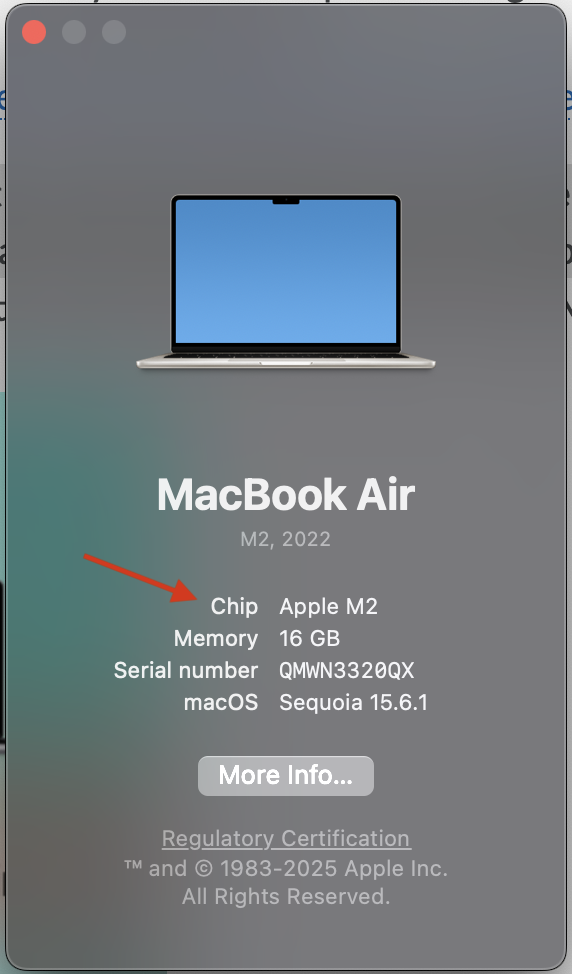
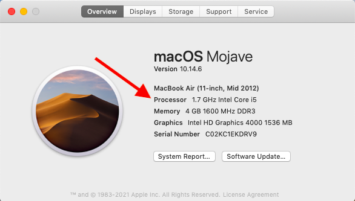
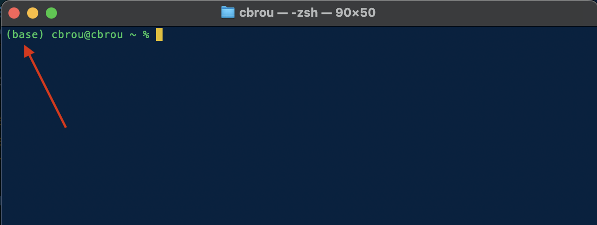
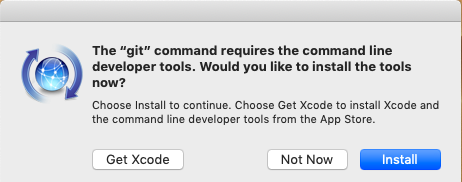
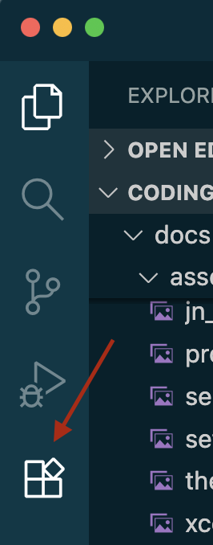

# Setting up your computer

## Windows Standard Setup

!!! note
    
    If you are using Windows 11, this operating system will attempt to route all of your files into your OneDrive folder. You will need to choose the C drive as your the installation path (i.e., there should be no mention of OneDrive in the installation path).

### Download Miniconda (a command prompt environment)

Miniconda is a tool for working with Python that helps to manage source code and libraries.

- Go to the Anaconda download page: [https://www.anaconda.com/download/success](hhttps://www.anaconda.com/download/success)
- Choose and download the latest version of ***Miniconda*** for your operating system.
- In your list of programs, there will now be a folder titled Anaconda3. There will be a "Prompt" and "Powershell Prompt" in this follder-- for these workshops, **always** use **"Powershell Prompt"**.


### Download Visual Studio Code (a code editor)

Visual Studio Code (commonly referred to as "VSCode") is a lightweight but powerful source code editor which runs on your desktop. It also easily opens Jupyter Notebook. Jupyter Notebook is a platform in which you can write and test Python code.  

- You can download VSCode directly from their home page: [https://code.visualstudio.com/](https://code.visualstudio.com/)

!!! note
    Allow VS Code to access public networks upon install!

### Download Git (a tool to track your projects)

Git is an open access “version control system” that allows you to manage your computing projects and source code history.

  - Install the Git "Standalone Installer" from here: [https://git-scm.com/download/win](https://git-scm.com/download/win)

GitHub is a web-based hosting service for Git repositories, allowing you to share the project you are tracking with Git publically or with a team. You will be able to upload your projects to this account and then share them via Git.

- Create a GitHub account at [https://github.com/](https://github.com/).

### Install Jupyter Notebook (for writing readable code)

Jupyter Notebook is an open-source application that you can use to create and share documents that contain live code, equations, visualizations, and text in Python. 

- Open the "Anaconda3 **Powershell** Prompt"
- Once the application is loaded and awaiting a prompt (ie the cursor is blinking), enter the command:
```
conda install -c conda-forge notebook
```
- You will be prompted to confirmed what the conda installer is doing during this process with something that looks like "[y]es" or "[a]ccept"-- to agree and continue with the installation, simply type the letter that is presented in between the brackets (ie "y")!

## MacOS Standard Setup

### Download Miniconda (a Python development environment)

Miniconda is a tool for working with Python that helps to manage source code and libraries.

- Go to the Anaconda download page: [https://www.anaconda.com/download/success](https://www.anaconda.com/download/success)
- **To choose the right installer,** first determine if your Mac has an Intel processor or an Apple M[x] silicon processor. Choose "**About This Mac**" from the Apple icon menu in the upper left corner of your laptop.
  
    
    

- If the line the arrow is pointing to says **Intel**, then download the "64-Bit (**Intel chip**) **Graphical** Installer"
- If the line the arrow is pointing to says **M**, then download the "64-Bit (**Apple silicon**) **Graphical** Installer"
- To install, locate the `pkg` file you have now downloaded (it's likely in your "Downloads" folder) and double click to open. Follow the "Continue" button until the install begins!
- To confirm that Miniconda has successfully been installed, open the application called "Terminal" (this is your command line). You should see "base" at the beginning of the prompt once the application is loaded-- this means Miniconda is activated!
  


### Download Visual Studio Code (a code editor)

Visual Studio Code (commonly referred to as "VSCode") is a lightweight but powerful source code editor which runs on your desktop. It also easily opens Jupyter Notebook. Jupyter Notebook is a platform in which you can write and test Python code.  

- You can download VSCode directly from their home page: [https://code.visualstudio.com/](https://code.visualstudio.com/)

### Download Git (a tool to track your projects)

Git is an open access “version control system” that allows you to manage your computing projects and source code history.

- To check if Git is already installed on your computer, open "Terminal" and enter the following command:
```
git --version
```

- If Git is already installed, you’ll see a message that looks something like:
```
git version 2.39.5 (Apple Git-154)
```

- If Git is not installed, you may be prompted to download and install Git as part of the "command-line developers tools" package. If this is the case, then accept and select "Install"!
  
    

!!! warning 

    Don’t choose Get Xcode! Xcode is a development environment for building and testing macOS and iOS apps. It’s a very large download and not needed for this workshop.

- **If you don’t get a prompt to download command line tools,** open "Terminal" and enter the following command:
```
xcode-select --install
```
- You should now see a prompt similar to the one pictured above-- click "Install"!
- After the installation is complete, open "Terminal" once again and enter the `git --version` command to confirm git has been successfully installed (aka the version is displayed).

GitHub is a web-based hosting service for Git repositories, allowing you to share the project you are tracking with Git publically or with a team. You will be able to upload your projects to this account and then share them via Git.

- Create a GitHub account at [https://github.com/](https://github.com/).

### Install Jupyter Notebook (for writing readable code)

Jupyter Notebook is an open-source application that you can use to create and share documents that contain live code, equations, visualizations, and text in Python. 

- Open "Terminal"
- Once the application is loaded and awaiting a prompt (ie the cursor is blinking), enter the command:
```
conda install -c conda-forge notebook
```
- You will be prompted to confirmed what the conda installer is doing during this process with something that looks like "[y]es" or "[a]ccept"-- to agree and continue with the installation, simply type the letter that is presented in between the brackets (ie "y")!

## VSCode Extensions

In VSCode, we can add extensions to make certain tasks easier! To search for and install these extensions, click the "building blocks" icon located in the left sidebar navigation.



For these workshops, we ask that you install...

### Markdown All in One
- By Yu Zhang
- Markdown is a plain text formatting syntax aimed at making writing for the internet easier, and "Markdown All in One" makes writing markdown easier!
- It helps with formatting and auto-completion when writing markdown in VSCode

### Jupyter
- Published directly by Microsoft
- This is what allows us to use Jupyter Notebooks in VSCode!
- When you first install this extension, you may get an additional pop-up in VSCode asking you if you'd like to install related extensions like "Python"-- make sure to agree, so these get installed as well!


